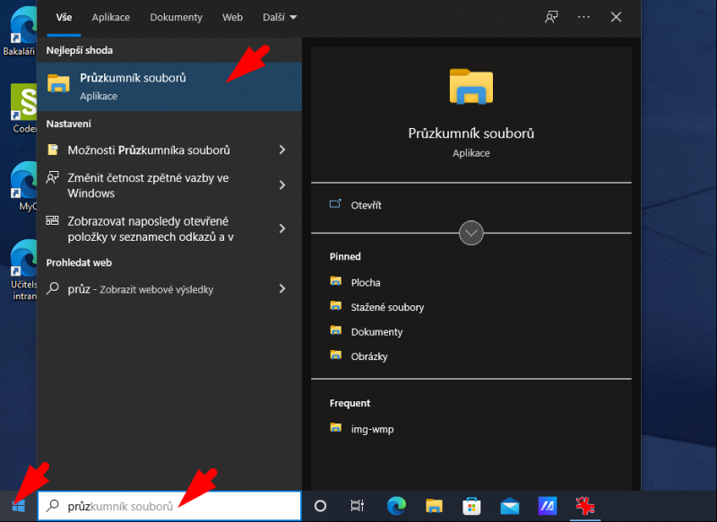
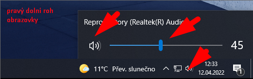

# Maturitní poslechový subtest — spuštění přehrávače

Stejně jako loni se i letos bude poslech pro poslechový subtest testu z&nbsp;cizího jazyka spouštět z&nbsp;počítače v&nbsp;učebně.

## Než začnete spouštět poslech, ověřte:

1. Máte spuštěný počítač a jste přihlášení.
2. Jestli je zapnutý zesilovač ve stole.
3. Jestli je počítač zapnutý a má zapnutý výstup:
    [Kontrola zvukového výstupu](img/mat-cd_07_hlasitost.png)

## Doporučený postup spuštění poslechu:

1. Spusťte aplikaci _Průzkumník souborů_ 
1. Vyberte v&nbsp;levém okně zvolte _Tento počítač_ 
1. Pravým tlačítkem klikněte na DVD mechaniku a zvolte _Přehrát_ 
1. Pokud spouštíte přehrávač poprvé, musíte potvrdit doporučené nastavení. Podruhé se již tento dialog nezobrazí 
1. Kliknutím na ikonku vpravo nahoře zobrazte přehrávané stopy 
1. Přepněte zobrazení stop, abyste viděli, která stopa se přehrává 
1. Pokud je zvuk slabý, zkontrolujte nastavení hlasitosti vpravo dole na liště 
1. Po úvodní stopě upravte hlasitost podle požadavků účastníků. Přehrávání můžete dočasně pozastavit.
1. Během přehrávání:
    1. Necháte nahrávku běžet a nezasahujete do ní.
    2. Sledujete, která stopa se už přehrála a která se právě přehrává. Čísla stop si poznačte na papír.
    3. V&nbsp;případě přerušení a nového spuštění nahrávky musíte přehrávání spustit od stopy, která hrála v&nbsp;době přerušení. Účastníci nesmí předchozí stopy slyšet dvakrát.
1. Po skončení přehrávání zavřete přehrávač, zvolte _Vysunout disk_ a vyjměte disk z&nbsp;mechaniky. 

## V&nbsp;případě přerušení přehrávání:

- Spusťte znovu **pouze poslední stopu**. Účastníci nesmí slyšet celý poslech znovu od začátku!
    Poslech spouštíte od té stopy, která hrála jako poslední v&nbsp;době přerušení.

## V&nbsp;případě dalších problémů volejte Marcelu Zlatníkovou!
