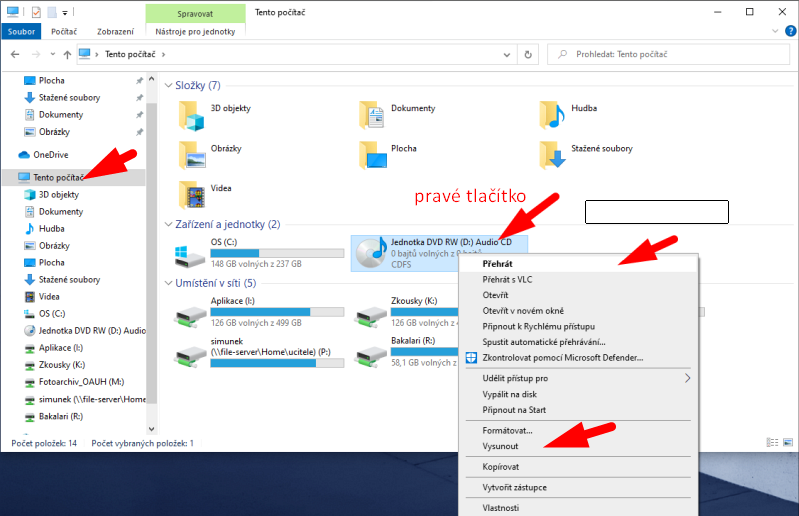

# Maturitní poslechový subtest — spuštění přehrávače

Stejně jako loni se i letos bude poslech pro poslechový subtest testu z&nbsp;cizího jazyka spouštět z&nbsp;počítače v&nbsp;učebně.

## Než začnete spouštět poslech, ověřte:

1. Spusťte počítač a přihlášte se.
2. Zapněte zesilovač ve stole a zkontrolujte nastavení podle přelepek na zesilovači (pokud jsou).
2. Vložte CD z&nbsp;obálky do DVD mechaniky počítače.
    - Mechanika se otevírá stisknutím dvířek mechaniky na předním panelu počítače.
3. Zkontrolujte, jestli má počítač zapnutý zvukový výstup:
    

## Doporučený postup spuštění poslechu:

1. Spusťte aplikaci _Průzkumník souborů_  
   
1. Vyberte v&nbsp;levém okně položku _Tento počítač_  
   
1. **Pravým tlačítkem** klikněte na DVD mechaniku a zvolte _Přehrát  
   
1. Pokud spouštíte přehrávač na daném počítači poprvé, musíte potvrdit doporučené nastavení. Podruhé se již tento dialog nezobrazí  
   
1. Najeďte do okna přehrávače kurzorem myši a kliknutím na ikonku vpravo nahoře zobrazte přehrávané stopy  
   
1. Aktuálně přehrávaná stopa je zvýrazněna modrým písmem. Sledujte, která stopa se přehrává a dělejte si poznámky.  
   
1. Po úvodní stopě upravte hlasitost podle požadavků účastníků. Přehrávání můžete dočasně pozastavit.
1. Pokud je zvuk slabý, zkontrolujte nastavení hlasitosti vpravo dole na liště  
   
1. Během přehrávání:
    1. Necháte nahrávku běžet a nezasahujete do ní.
    2. Sledujete, která stopa se už přehrála a která se právě přehrává. Čísla stop si poznačte na papír.
    3. V&nbsp;případě přerušení a nového spuštění nahrávky musíte přehrávání spustit od stopy, která hrála v&nbsp;době přerušení. Účastníci nesmí předchozí stopy slyšet dvakrát.
1. Po skončení přehrávání zavřete přehrávač, zvolte _Vysunout disk_ a vyjměte disk z&nbsp;mechaniky.  
   

## V&nbsp;případě přerušení přehrávání:

- Spusťte znovu **pouze poslední stopu**. Účastníci nesmí slyšet celý poslech znovu od začátku!
    Poslech spouštíte od té stopy, která hrála jako poslední v&nbsp;době přerušení.

## V&nbsp;případě dalších problémů volejte Marcelu Zlatníkovou!
